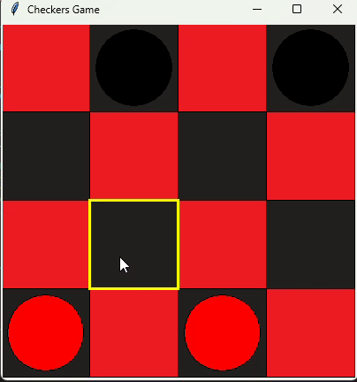

# Code in Place 2025 Final Project

Final project for the CIP 2025 online course from Stanford University.

# Mini Checkers Game

## Description

Checkers is a classic two-player board game. This version uses a 4x4 board instead of the traditional 8x8 board. Implemented in Python with the tkinter library, it features an interactive graphical user interface. Players take turns moving their pieces diagonally, aiming to capture their opponent's pieces and promote their own pieces to kings.

## Features

1. **Two-player mode:** Play against a friend on the same device.
2. **Graphical Interface:** A visually appealing board created using the tkinter library.
3. **Captures and Kings:** Capture opponent pieces by jumping over them and promote pieces to kings when they reach the opposite side.
4. **Highlighting:** Shows possible moves and captures for the current player's pieces.
5. **Win Detection:** Automatically checks for and declares the winner when the game ends.

## Demo



## Requirements

- Python

- Pillow

## Setup Instructions

#### Using Bash

1.  **Clone the repository:**

    ```sh
    git clone https://github.com/hasiniliyanawadu/CodeInPlace2025_FinalProject.git
    cd CodeInPlace2025_FinalProject

    ```

2.  **Virtual Environment (optional but recommended):**

    - Recommended for isolation and avoiding conflicts but not strictly necessary.

    1. Create a virtual environment:

       ```sh
       python -m venv venv
       ```

    2. Activate the virtual environment:

       - **On Windows**

       ```sh
       source venv/Scripts/activate
       ```

       - **On macOS and Linux**

       ```sh
       source venv/bin/activate
       ```

    #### Ensure Python is installed and accessible in your PATH environment variable.

3.  **Install the dependencies:**

    ```sh
    pip install Pillow
    ```

4.  **Run the game:**

    ```sh
    py main.py
    ```

## How to Play

- **Start the game:** Run _`py main.py`_ on the terminal to open the game window.
- **Select a piece:** Click on one of your pieces (red starts first).
- **Move the piece:** Click on a highlighted square to move the selected piece.
- **Capture:** Jump over your opponent's pieces to capture them.

## Game Rules

### Basic Rules

1. **Players and Pieces:**

   - The game is played between two players: one controls the red pieces, and the other controls the black pieces.
   - Each player starts with 2 pieces placed on their respective sides of a 4x4 board.

2. **Movement:**

   - Pieces move diagonally forward to an adjacent empty square.
   - If a piece reaches the opponent's back row, it is crowned as a king. Kings can move diagonally forward and backward.

3. **Capturing:**

   - A piece can capture an opponent's piece by jumping over it. The landing square must be empty.
   - Kings can move and capture both forward and backward diagonally.

4. **Turn Rotation:**

   - Players alternate turns. After a player completes their move, the turn switches to the other player.
   - The current player is highlighted to indicate whose turn it is.

5. **Legal Moves:**

   - The game highlights possible moves and captures for the current player's selected piece.
   - Clicking on a piece highlights all legal moves and captures for that piece.

6. **Winning the Game:**
   - A player wins by capturing all the opponent's pieces or blocking all possible moves of the opponent (forcing a stalemate).
   - The game will display a message box announcing the winner or indicating a tie.

---

## Future Implementations

In future updates, I plan to expand the game to a full 8x8 board for a more traditional Checkers experience.

### Additional Notes

Make sure Python is installed to run the game.
During installation, click on `Add python.exe to PATH` to ensure Python can be used in any command prompt or Git Bash window.
[Downloads](https://www.python.org/downloads/)

The game uses Pillow for image handling and tkinter for the GUI.
